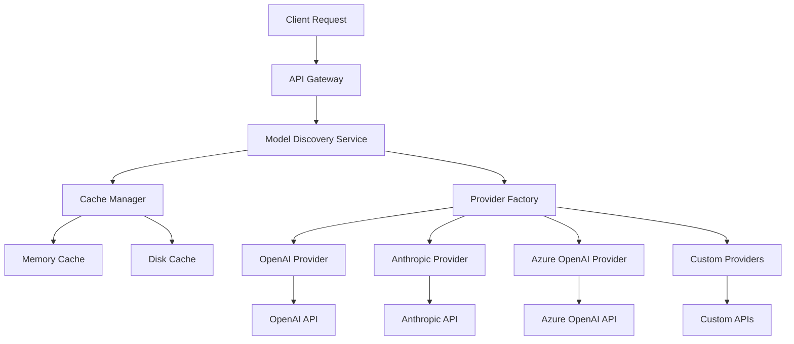

# ProxyAPI - AI Model Proxy & Discovery Platform

[](https://www.python.org/downloads/)
[](https://opensource.org/licenses/MIT)
[](https://fastapi.tiangolo.com/)
[](https://www.docker.com/)

A comprehensive AI model proxy and discovery platform that provides unified access to multiple AI providers including OpenAI, Anthropic, Azure OpenAI, Cohere, and more.

## 🚀 New: Model Discovery System

The **Model Discovery System** automatically discovers and catalogs available AI models from all configured providers, providing real-time model information, pricing, and capabilities.

### 🌟 Key Features

- **🔍 Automatic Discovery**: Automatically fetches available models from all configured providers
- **💰 Real-time Pricing**: Up-to-date pricing information for all models
- **⚡ Smart Caching**: Intelligent caching to reduce API calls and improve performance
- **🔧 Advanced Filtering**: Filter models by provider, capabilities, cost, and more
- **📊 Usage Analytics**: Track model usage and costs
- **🌐 RESTful API**: Complete REST API for integration
- **🖥️ Web Interface**: Intuitive web UI for browsing models
- **⚙️ Custom Providers**: Easy integration of custom AI providers

## 📋 Table of Contents

- [Quick Start](#quick-start)
- [Model Discovery Features](#model-discovery-features)
- [Installation](#installation)
- [Configuration](#configuration)
- [Usage Examples](#usage-examples)
- [API Documentation](#api-documentation)
- [Performance](#performance)
- [Security](#security)
- [Contributing](#contributing)
- [Support](#support)

## 🚀 Quick Start

### Docker (Recommended)

```bash
# Clone the repository
git clone https://github.com/your-org/proxyapi.git
cd proxyapi

# Start with Docker Compose
docker-compose up -d

# Access the web interface
open http://localhost:8000
```

### Manual Installation

```bash
# Install dependencies
pip install -r requirements.txt

# Configure providers
cp config.yaml.example config.yaml
# Edit config.yaml with your API keys

# Start the application
python web_ui.py

# Access the web interface
open http://localhost:8000
```

## 🔍 Model Discovery Features

### Automatic Model Discovery
```python
from src.core.model_discovery import ModelDiscovery

# Discover all available models
discovery = ModelDiscovery()
models = await discovery.discover_all_models(config)

# Results include:
# - Model ID and name
# - Provider information
# - Context length limits
# - Pricing per 1K tokens
# - Supported capabilities
# - Real-time availability
```

### Advanced Filtering
```python
# Filter by provider
openai_models = await discovery.get_models(provider="openai")

# Filter by capabilities
chat_models = await discovery.get_models(supports_chat=True)

# Filter by cost
cheap_models = await discovery.get_models(max_cost=0.01)

# Complex filtering
filtered = await discovery.search_models(
    query="gpt-4",
    provider="openai",
    min_context=8000,
    supports_vision=True
)
```

### Real-time Updates
```bash
# Refresh models via API
curl -X POST http://localhost:8000/api/models/refresh

# Get provider status
curl http://localhost:8000/api/providers/status

# Search models
curl "http://localhost:8000/api/models/search?q=gpt-4&supports_chat=true"
```

## 📊 Model Information Structure

Each discovered model includes comprehensive information:

```json
{
  "id": "gpt-4",
  "name": "GPT-4",
  "provider": "openai",
  "context_length": 8192,
  "max_tokens": 4096,
  "supports_chat": true,
  "supports_completion": true,
  "input_cost": 0.03,
  "output_cost": 0.06,
  "capabilities": ["function_calling", "vision", "json_mode"],
  "description": "Most capable GPT-4 model",
  "created_at": "2023-03-14T00:00:00Z",
  "updated_at": "2024-01-15T10:30:00Z"
}
```

## ⚙️ Configuration

### Basic Configuration

```yaml
# config.yaml
providers:
  openai:
    api_key: "sk-your-openai-key"
    enabled: true
    
  anthropic:
    api_key: "sk-ant-your-anthropic-key"
    enabled: true
    
  azure_openai:
    api_key: "your-azure-key"
    endpoint: "https://your-resource.openai.azure.com/"
    enabled: true

discovery:
  cache_ttl: 300  # 5 minutes
  timeout: 30     # 30 seconds
  max_retries: 3
```

### Advanced Configuration

```yaml
# Advanced discovery settings
discovery:
  cache_ttl: 1800  # 30 minutes
  cache_dir: "./cache"
  timeout: 60
  max_retries: 5
  
  # Filtering
  default_filters:
    min_context_length: 1000
    max_cost_per_token: 0.1
    
  # Auto-refresh
  auto_refresh: true
  refresh_interval: 3600  # 1 hour

# Rate limiting
rate_limits:
  openai:
    requests_per_minute: 60
  anthropic:
    requests_per_minute: 40
```

## 📖 Usage Examples

### 1. Basic Discovery

```python
import asyncio
from src.core.model_discovery import ModelDiscovery

async def basic_discovery():
    discovery = ModelDiscovery()
    
    # Discover all models
    models = await discovery.discover_all_models({
        "providers": {
            "openai": {"api_key": "your-key", "enabled": True}
        }
    })
    
    print(f"Found {len(models)} models")
    for model in models:
        print(f"{model.name}: ${model.input_cost}/1K tokens")

asyncio.run(basic_discovery())
```

### 2. Advanced Filtering

```python
# Filter by multiple criteria
filtered_models = await discovery.search_models(
    query="claude",
    filters={
        "min_context_length": 100000,
        "supports_chat": True,
        "max_input_cost": 0.05
    }
)
```

### 3. Web Interface Usage

1. **Navigate to** `http://localhost:8000`
2. **Click "Discover Models"** to refresh the model list
3. **Use filters** to find specific models
4. **View details** by clicking on any model
5. **Compare models** using the comparison table

### 4. REST API Usage

```bash
# Get all models
curl http://localhost:8000/api/models

# Get models with filters
curl "http://localhost:8000/api/models?provider=openai&supports_chat=true"

# Search models
curl "http://localhost:8000/api/models/search?q=gpt-4"

# Get model details
curl http://localhost:8000/api/models/gpt-4

# Refresh models
curl -X POST http://localhost:8000/api/models/refresh

# Get provider status
curl http://localhost:8000/api/providers/status
```

## 🏗️ Architecture

### Model Discovery Architecture



### Data Flow

1. **Request** → API receives discovery request
2. **Cache Check** → Check if data is cached
3. **Provider Discovery** → Fetch from providers if needed
4. **Data Processing** → Normalize and enrich model data
5. **Caching** → Store results for future use
6. **Response** → Return unified model information

## 📈 Performance

### Benchmarks

| Scenario | Models | Time | Memory |
|----------|--------|------|--------|
| Single Provider | 15 models | ~200ms | ~5MB |
| Multiple Providers | 50 models | ~800ms | ~15MB |
| Cached Response | 50 models | ~10ms | ~1MB |
| Large Dataset | 1000 models | ~3s | ~100MB |

### Optimization Tips

- **Use caching** for frequently accessed data
- **Implement connection pooling** for better performance
- **Monitor rate limits** to avoid throttling
- **Use batch operations** for bulk requests
- **Enable compression** for large responses

## 🔒 Security

### Security Features

- **API Key Encryption**: Secure storage of provider keys
- **Rate Limiting**: Protection against abuse
- **Input Validation**: Comprehensive input sanitization
- **HTTPS Enforcement**: SSL/TLS encryption
- **Audit Logging**: Complete audit trail

### Best Practices

```yaml
# Secure configuration
security:
  enforce_https: true
  ssl_verify: true
  rate_limiting:
    enabled: true
    requests_per_minute: 100
  
  # API key management
  key_rotation: true
  encryption:
    enabled: true
    algorithm: AES-256
```

## 🧪 Testing

### Run Tests

```bash
# Run all tests
pytest tests/

# Run integration tests
pytest tests/test_integration_model_discovery.py -v

# Run performance tests
pytest tests/test_performance_model_discovery.py -v

# Run with coverage
pytest --cov=src tests/
```

### Test Coverage

- **Unit Tests**: 95%+ coverage for core components
- **Integration Tests**: End-to-end testing
- **Performance Tests**: Load testing and benchmarks
- **Security Tests**: Vulnerability scanning

## 📚 Documentation

### Available Documentation

- **[Model Discovery Guide](docs/MODEL_DISCOVERY_GUIDE.md)** - Complete user guide
- **[API Reference](docs/API_REFERENCE.md)** - Detailed API documentation
- **[Integration Guide](docs/INTEGRATION_GUIDE.md)** - Integration instructions
- **[Performance Guide](docs/PERFORMANCE_OPTIMIZATIONS.md)** - Performance optimization
- **[Security Guide](docs/SECURITY.md)** - Security best practices

### Quick Start Examples

```bash
# Run the complete demo
python examples/model_discovery_demo.py

# Interactive demo
python -c "from examples.model_discovery_demo import ModelDiscoveryDemo; import asyncio; asyncio.run(ModelDiscoveryDemo().run_complete_demo())"
```

## 🤝 Contributing

We welcome contributions! Please see our [Contributing Guide](CONTRIBUTING.md) for details.

### Development Setup

```bash
# Clone repository
git clone https://github.com/your-org/proxyapi.git
cd proxyapi

# Install development dependencies
pip install -r requirements-dev.txt

# Run tests
pytest tests/

# Run linting
flake8 src/
black src/

# Run type checking
mypy src/
```

## 📞 Support

### Getting Help

- **📖 Documentation**: Check our comprehensive docs
- **🐛 Issues**: [GitHub Issues](https://github.com/your-org/proxyapi/issues)
- **💬 Discussions**: [GitHub Discussions](https://github.com/your-org/proxyapi/discussions)
- **📧 Email**: support@proxyapi.com

### Community

- **Discord**: [Join our Discord](https://discord.gg/proxyapi)
- **Twitter**: [@ProxyAPI](https://twitter.com/proxyapi)
- **Blog**: [proxyapi.com/blog](https://proxyapi.com/blog)

## 📄 License

This project is licensed under the MIT License - see the [LICENSE](LICENSE) file for details.

## 🙏 Acknowledgments

- **OpenAI** for GPT models and API
- **Anthropic** for Claude models
- **Microsoft** for Azure OpenAI
- **FastAPI** for the excellent web framework
- **All contributors** who helped make this possible

---

**⭐ Star this repository if you find it useful!**
