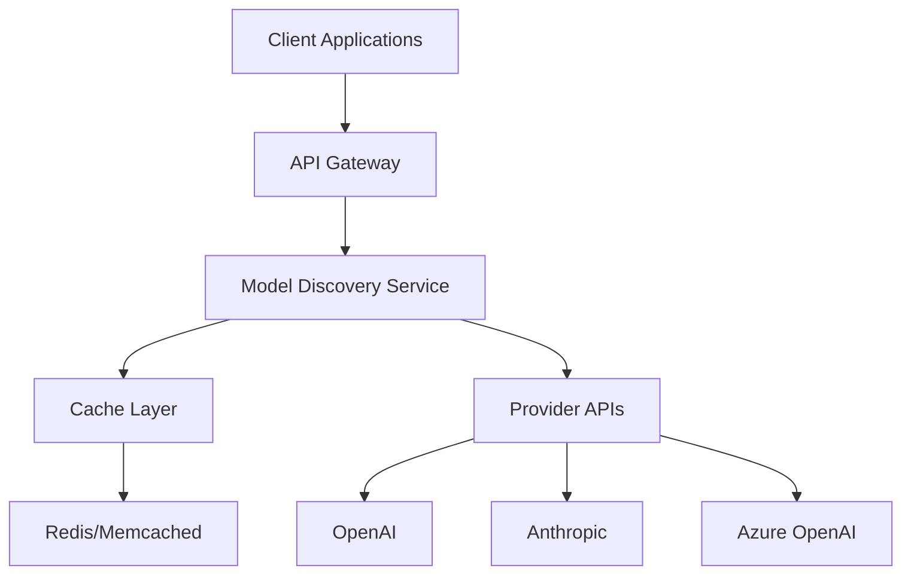

# Integration Guide

A comprehensive guide for integrating the Model Discovery system into your applications, services, and workflows.

## Table of Contents

- [Quick Integration](#quick-integration)
- [Integration Patterns](#integration-patterns)
- [SDK Integration](#sdk-integration)
- [API Integration](#api-integration)
- [Webhook Integration](#webhook-integration)
- [Database Integration](#database-integration)
- [Monitoring & Observability](#monitoring--observability)
- [Security Integration](#security-integration)
- [Performance Optimization](#performance-optimization)
- [Testing Integration](#testing-integration)
- [Deployment Strategies](#deployment-strategies)
- [Migration Guide](#migration-guide)

## Quick Integration

### 1. Docker Integration

```dockerfile
FROM python:3.11-slim

WORKDIR /app

COPY requirements.txt .
RUN pip install -r requirements.txt

COPY . .

EXPOSE 8000

CMD ["python", "web_ui.py"]
```

### 2. Docker Compose

```yaml
version: '3.8'
services:
  proxyapi:
    build: .
    ports:
      - "8000:8000"
    environment:
      - OPENAI_API_KEY=${OPENAI_API_KEY}
      - ANTHROPIC_API_KEY=${ANTHROPIC_API_KEY}
    volumes:
      - ./config.yaml:/app/config.yaml
      - ./cache:/app/cache
    restart: unless-stopped
    
  redis:
    image: redis:7-alpine
    ports:
      - "6379:6379"
```

### 3. Kubernetes Deployment

```yaml
apiVersion: apps/v1
kind: Deployment
metadata:
  name: proxyapi-discovery
spec:
  replicas: 3
  selector:
    matchLabels:
      app: proxyapi-discovery
  template:
    metadata:
      labels:
        app: proxyapi-discovery
    spec:
      containers:
      - name: proxyapi
        image: proxyapi:latest
        ports:
        - containerPort: 8000
        env:
        - name: OPENAI_API_KEY
          valueFrom:
            secretKeyRef:
              name: api-keys
              key: openai
        - name: ANTHROPIC_API_KEY
          valueFrom:
            secretKeyRef:
              name: api-keys
              key: anthropic
        volumeMounts:
        - name: config
          mountPath: /app/config
        - name: cache
          mountPath: /app/cache
      volumes:
      - name: config
        configMap:
          name: proxyapi-config
      - name: cache
        emptyDir: {}
```

## Integration Patterns

### 1. Microservice Architecture



### 2. Event-Driven Architecture

```python
# Event publisher
from src.core.events import EventPublisher

publisher = EventPublisher()
await publisher.publish("models.discovered", {
    "models": models,
    "provider": "openai",
    "timestamp": datetime.utcnow()
})

# Event subscriber
from src.core.events import EventSubscriber

subscriber = EventSubscriber()
@subscriber.on("models.discovered")
async def handle_model_discovery(event):
    await update_local_cache(event.data)
```

### 3. CQRS Pattern

```python
# Command side (writes)
class ModelDiscoveryCommand:
    async def refresh_models(self, provider: str):
        await discovery_service.refresh_provider(provider)
    
    async def invalidate_cache(self, provider: str):
        await cache_manager.invalidate(provider)

# Query side (reads)
class ModelDiscoveryQuery:
    async def get_models(self, filters: dict):
        return await cache_manager.get_filtered_models(filters)
    
    async def get_model_details(self, model_id: str):
        return await cache_manager.get_model(model_id)
```

## SDK Integration

### Python SDK

#### Installation
```bash
pip install proxyapi-discovery-sdk
```

#### Basic Usage
```python
from proxyapi_discovery import DiscoveryClient

# Initialize client
client = DiscoveryClient(
    base_url="http://localhost:8000",
    api_key="your-api-key"  # Optional
)

# Get all models
models = client.get_models()

# Search models
results = client.search_models(
    query="gpt-4",
    provider="openai",
    supports_chat=True
)

# Get model details
model = client.get_model("gpt-4")
```

#### Async Usage
```python
import asyncio
from proxyapi_discovery import AsyncDiscoveryClient

async def main():
    client = AsyncDiscoveryClient("http://localhost:8000")
    
    # Get models with caching
    models = await client.get_models(use_cache=True)
    
    # Force refresh
    fresh_models = await client.refresh_models()
    
    await client.close()

asyncio.run(main())
```

### JavaScript/Node.js SDK

#### Installation
```bash
npm install proxyapi-discovery-sdk
```

#### Usage
```javascript
const { DiscoveryClient } = require('proxyapi-discovery-sdk');

const client = new DiscoveryClient({
  baseURL: 'http://localhost:8000',
  timeout: 30000
});

// Get all models
const models = await client.getModels({
  provider: 'openai',
  supportsChat: true
});

// Search models
const results = await client.searchModels('gpt-4', {
  minContext: 8000,
  maxCost: 0.05
});

// Real-time updates
client.onModelUpdate((update) => {
  console.log('Model updated:', update);
});
```

### Go SDK

#### Installation
```bash
go get github.com/proxyapi/discovery-sdk-go
```

#### Usage
```go
package main

import (
    "context"
    "fmt"
    "github.com/proxyapi/discovery-sdk-go"
)

func main() {
    client := discovery.NewClient("http://localhost:8000")
    
    // Get models
    models, err := client.GetModels(context.Background(), &discovery.GetModelsRequest{
        Provider:     "openai",
        SupportsChat: true,
    })
    if err != nil {
        panic(err)
    }
    
    fmt.Printf("Found %d models\n", len(models))
}
```

## API Integration

### REST API Integration

#### 1. Direct HTTP Integration

```python
import requests
import asyncio
from typing import List, Dict, Any

class ModelDiscoveryAPI:
    def __init__(self, base_url: str = "http://localhost:8000"):
        self.base_url = base_url
        self.session = requests.Session()
    
    def get_models(self, **filters) -> List[Dict[str, Any]]:
        """Get all models with optional filters."""
        params = {k: v for k, v in filters.items() if v is not None}
        response = self.session.get(
            f"{self.base_url}/api/models",
            params=params,
            timeout=30
        )
        response.raise_for_status()
        return response.json()["models"]
    
    def search_models(self, query: str, **filters) -> List[Dict[str, Any]]:
        """Search models with query and filters."""
        params = {"q": query, **filters}
        response = self.session.get(
            f"{self.base_url}/api/models/search",
            params=params,
            timeout=30
        )
        response.raise_for_status()
        return response.json()["models"]
    
    def refresh_models(self, providers: List[str] = None) -> Dict[str, Any]:
        """Force refresh models from providers."""
        data = {"providers": providers} if providers else {}
        response = self.session.post(
            f"{self.base_url}/api/models/refresh",
            json=data,
            timeout=60
        )
        response.raise_for_status()
        return response.json()

# Usage
api = ModelDiscoveryAPI()
models = api.get_models(provider="openai", supports_chat=True)
```

#### 2. Async HTTP Integration

```python
import aiohttp
import asyncio
from typing import List, Dict, Any

class AsyncModelDiscoveryAPI:
    def __init__(self, base_url: str = "http://localhost:8000"):
        self.base_url = base_url
        self.session = None
    
    async def __aenter__(self):
        self.session = aiohttp.ClientSession()
        return self
    
    async def __aexit__(self, exc_type, exc_val, exc_tb):
        if self.session:
            await self.session.close()
    
    async def get_models(self, **filters) -> List[Dict[str, Any]]:
        """Get all models with optional filters."""
        params = {k: str(v) for k, v in filters.items() if v is not None}
        async with self.session.get(
            f"{self.base_url}/api/models",
            params=params,
            timeout=aiohttp.ClientTimeout(total=30)
        ) as response:
            response.raise_for_status()
            data = await response.json()
            return data["models"]
    
    async def search_models(self, query: str, **filters) -> List[Dict[str, Any]]:
        """Search models with query and filters."""
        params = {"q": query, **{k: str(v) for k, v in filters.items()}}
        async with self.session.get(
            f"{self.base_url}/api/models/search",
            params=params,
            timeout=aiohttp.ClientTimeout(total=30)
        ) as response:
            response.raise_for_status()
            data = await response.json()
            return data["models"]

# Usage
async def main():
    async with AsyncModelDiscoveryAPI() as api:
        models = await api.get_models(provider="openai")
        print(f"Found {len(models)} models")

asyncio.run(main())
```

### GraphQL Integration

```python
import asyncio
from gql import Client, gql
from gql.transport.aiohttp import AIOHTTPTransport

class GraphQLModelDiscovery:
    def __init__(self, endpoint: str = "http://localhost:8000/graphql"):
        transport = AIOHTTPTransport(url=endpoint)
        self.client = Client(transport=transport, fetch_schema_from_transport=True)
    
    async def get_models(self, provider: str = None):
        query = gql("""
            query GetModels($provider: String) {
                models(provider: $provider) {
                    id
                    name
                    provider
                    contextLength
                    maxTokens
                    inputCost
                    outputCost
                    supportsChat
                    supportsCompletion
                }
            }
        """)
        
        result = await self.client.execute(query, variable_values={"provider": provider})
        return result["models"]
    
    async def search_models(self, query: str, filters: dict = None):
        search_query = gql("""
            query SearchModels($query: String!, $filters: ModelFilters) {
                searchModels(query: $query, filters: $filters) {
                    id
                    name
                    provider
                    contextLength
                    maxTokens
                    inputCost
                    outputCost
                }
            }
        """)
        
        variables = {"query": query, "filters": filters}
        result = await self.client.execute(search_query, variable_values=variables)
        return result["searchModels"]
```

## Webhook Integration

### 1. Outgoing Webhooks

```python
from fastapi import FastAPI, HTTPException
from pydantic import BaseModel
import httpx

class WebhookConfig(BaseModel):
    url: str
    events: List[str]
    secret: str = None

class WebhookManager:
    def __init__(self):
        self.webhooks: List[WebhookConfig] = []
    
    def add_webhook(self, config: WebhookConfig):
        self.webhooks.append(config)
    
    async def send_webhook(self, event: str, data: dict):
        async with httpx.AsyncClient() as client:
            for webhook in self.webhooks:
                if event in webhook.events:
                    headers = {"Content-Type": "application/json"}
                    if webhook.secret:
                        headers["X-Signature"] = self._generate_signature(data, webhook.secret)
                    
                    await client.post(
                        webhook.url,
                        json={"event": event, "data": data},
                        headers=headers,
                        timeout=30
                    )
    
    def _generate_signature(self, data: dict, secret: str) -> str:
        import hmac
        import hashlib
        import json
        
        payload = json.dumps(data, sort_keys=True).encode()
        return hmac.new(secret.encode(), payload, hashlib.sha256).hexdigest()

# Usage
webhook_manager = WebhookManager()
webhook_manager.add_webhook(WebhookConfig(
    url="https://your-app.com/webhooks/model-updates",
    events=["models.discovered", "models.updated"],
    secret="your-webhook-secret"
))
```

### 2. Incoming Webhooks

```python
from fastapi import FastAPI, Request, HTTPException
from pydantic import BaseModel

app = FastAPI()

class WebhookPayload(BaseModel):
    event: str
    data: dict

@app.post("/webhook/incoming")
async def handle_incoming_webhook(payload: WebhookPayload, request: Request):
    # Verify webhook signature
    signature = request.headers.get("X-Signature")
    if not verify_signature(payload.dict(), signature):
        raise HTTPException(status_code=401, detail="Invalid signature")
    
    # Handle webhook
    if payload.event == "models.updated":
        await refresh_local_cache(payload.data)
    
    return {"status": "processed"}
```

## Database Integration

### 1. PostgreSQL Integration

```python
import asyncpg
from typing import List, Dict, Any

class PostgreSQLModelStore:
    def __init__(self, connection_string: str):
        self.connection_string = connection_string
        self.pool = None
    
    async def initialize(self):
        self.pool = await asyncpg.create_pool(self.connection_string)
        
        # Create tables
        async with self.pool.acquire() as conn:
            await conn.execute("""
                CREATE TABLE IF NOT EXISTS models (
                    id VARCHAR(255) PRIMARY KEY,
                    name VARCHAR(255) NOT NULL,
                    provider VARCHAR(100) NOT NULL,
                    context_length INTEGER,
                    max_tokens INTEGER,
                    input_cost DECIMAL(10,6),
                    output_cost DECIMAL(10,6),
                    supports_chat BOOLEAN,
                    supports_completion BOOLEAN,
                    capabilities JSONB,
                    metadata JSONB,
                    created_at TIMESTAMP DEFAULT NOW(),
                    updated_at TIMESTAMP DEFAULT NOW()
                )
            """)
    
    async def store_models(self, models: List[Dict[str, Any]]):
        async with self.pool.acquire() as conn:
            await conn.executemany("""
                INSERT INTO models (id, name, provider, context_length, max_tokens, 
                                  input_cost, output_cost, supports_chat, supports_completion, 
                                  capabilities, metadata)
                VALUES ($1, $2, $3, $4, $5, $6, $7, $8, $9, $10, $11)
                ON CONFLICT (id) DO UPDATE SET
                    name = EXCLUDED.name,
                    context_length = EXCLUDED.context_length,
                    max_tokens = EXCLUDED.max_tokens,
                    input_cost = EXCLUDED.input_cost,
                    output_cost = EXCLUDED.output_cost,
                    supports_chat = EXCLUDED.supports_chat,
                    supports_completion = EXCLUDED.supports_completion,
                    capabilities = EXCLUDED.capabilities,
                    metadata = EXCLUDED.metadata,
                    updated_at = NOW()
            """, [
                (
                    m["id"], m["name"], m["provider"], m["context_length"],
                    m["max_tokens"], m["input_cost"], m["output_cost"],
                    m["supports_chat"], m["supports_completion"],
                    json.dumps(m.get("capabilities", [])),
                    json.dumps(m.get("metadata", {}))
                )
                for m in models
            ])
    
    async def search_models(self, query: str, filters: Dict[str, Any] = None):
        async with self.pool.acquire() as conn:
            sql = """
                SELECT * FROM models 
                WHERE name ILIKE $1 OR id ILIKE $1
            """
            params = [f"%{query}%"]
            
            if filters:
                for key, value in filters.items():
                    sql += f" AND {key} = ${len(params) + 1}"
                    params.append(value)
            
            rows = await conn.fetch(sql, *params)
            return [dict(row) for row in rows]
```

### 2. MongoDB Integration

```python
from motor.motor_asyncio import AsyncIOMotorClient
from typing import List, Dict, Any

class MongoDBModelStore:
    def __init__(self, connection_string: str, database: str = "proxyapi"):
        self.client = AsyncIOMotorClient(connection_string)
        self.db = self.client[database]
        self.models = self.db.models
    
    async def store_models(self, models: List[Dict[str, Any]]):
        # Bulk upsert
        operations = []
        for model in models:
            operations.append({
                "update_one": {
                    "filter": {"id": model["id"]},
                    "update": {"$set": model},
                    "upsert": True
                }
            })
        
        if operations:
            await self.models.bulk_write(operations)
    
    async def search_models(self, query: str, filters: Dict[str, Any] = None):
        search_filter = {
            "$or": [
                {"name": {"$regex": query, "$options": "i"}},
                {"id": {"$regex": query, "$options": "i"}}
            ]
        }
        
        if filters:
            search_filter.update(filters)
        
        cursor = self.models.find(search_filter)
        return await cursor.to_list(length=None)
```

## Monitoring & Observability

### 1. Prometheus Metrics

```python
from prometheus_client import Counter, Histogram, Gauge, start_http_server
import time

# Metrics
models_discovered = Counter('models_discovered_total', 'Total models discovered', ['provider'])
discovery_duration = Histogram('discovery_duration_seconds', 'Time spent discovering models')
cache_hits = Counter('cache_hits_total', 'Total cache hits', ['provider'])
cache_misses = Counter('cache_misses_total', 'Total cache misses', ['provider'])
active_providers = Gauge('active_providers', 'Number of active providers')

class MonitoredDiscoveryService:
    def __init__(self, discovery_service):
        self.discovery = discovery_service
    
    @discovery_duration.time()
    async def discover_models(self, provider: str):
        start_time = time.time()
        try:
            models = await self.discovery.discover_provider_models(provider)
            models_discovered.labels(provider=provider).inc(len(models))
            return models
        except Exception as e:
            # Log error
            raise
```

### 2. OpenTelemetry Integration

```python
from opentelemetry import trace
from opentelemetry.exporter.otlp.proto.grpc.trace_exporter import OTLPSpanExporter
from opentelemetry.sdk.trace import TracerProvider
from opentelemetry.sdk.trace.export import BatchSpanProcessor

# Setup tracing
trace.set_tracer_provider(TracerProvider())
tracer = trace.get_tracer(__name__)

# Configure exporter
otlp_exporter = OTLPSpanExporter(
    endpoint="localhost:4317",
    insecure=True
)
span_processor = BatchSpanProcessor(otlp_exporter)
trace.get_tracer_provider().add_span_processor(span_processor)

class TracedDiscoveryService:
    def __init__(self, discovery_service):
        self.discovery = discovery_service
    
    async def discover_models(self, provider: str):
        with tracer.start_as_current_span("discover_models") as span:
            span.set_attribute("provider", provider)
            
            try:
                models = await self.discovery.discover_provider_models(provider)
                span.set_attribute("models.count", len(models))
                return models
            except Exception as e:
                span.record_exception(e)
                raise
```

### 3. Health Checks

```python
from fastapi import FastAPI, Response
import asyncio

app = FastAPI()

@app.get("/health")
async def health_check():
    checks = {
        "discovery": await check_discovery_service(),
        "cache": await check_cache(),
        "providers": await check_providers(),
        "database": await check_database()
    }
    
    overall_health = all(checks.values())
    
    return {
        "status": "healthy" if overall_health else "unhealthy",
        "checks": checks,
        "timestamp": datetime.utcnow().isoformat()
    }

async def check_discovery_service():
    try:
        # Test discovery service
        models = await discovery_service.discover_provider_models("openai")
        return len(models) > 0
    except Exception:
        return False

async def check_cache():
    try:
        # Test cache connectivity
        await cache_manager.set("health_check", "ok", ttl=10)
        value = await cache_manager.get("health_check")
        return value == "ok"
    except Exception:
        return False
```

## Security Integration

### 1. API Key Management

```python
from cryptography.fernet import Fernet
import os

class SecureKeyManager:
    def __init__(self):
        self.cipher = Fernet(os.environ.get("ENCRYPTION_KEY", Fernet.generate_key()))
    
    def encrypt_key(self, api_key: str) -> str:
        return self.cipher.encrypt(api_key.encode()).decode()
    
    def decrypt_key(self, encrypted_key: str) -> str:
        return self.cipher.decrypt(encrypted_key.encode()).decode()
    
    def get_provider_key(self, provider: str) -> str:
        encrypted_key = os.environ.get(f"{provider.upper()}_API_KEY_ENCRYPTED")
        if encrypted_key:
            return self.decrypt_key(encrypted_key)
        return os.environ.get(f"{provider.upper()}_API_KEY")

# Usage
key_manager = SecureKeyManager()
openai_key = key_manager.get_provider_key("openai")
```

### 2. Rate Limiting

```python
from fastapi import FastAPI, Request, HTTPException
from slowapi import Limiter, _rate_limit_exceeded_handler
from slowapi.util import get_remote_address
from slowapi.errors import RateLimitExceeded

limiter = Limiter(key_func=get_remote_address)
app = FastAPI()
app.state.limiter = limiter
app.add_exception_handler(RateLimitExceeded, _rate_limit_exceeded_handler)

@app.get("/api/models")
@limiter.limit("100/minute")
async def get_models(request: Request):
    return await discovery_service.get_all_models()
```

### 3. Authentication & Authorization

```python
from fastapi import Depends, HTTPException, Security
from fastapi.security import HTTPBearer, HTTPAuthorizationCredentials
import jwt

security = HTTPBearer()

class AuthService:
    def __init__(self, secret_key: str):
        self.secret_key = secret_key
    
    def verify_token(self, credentials: HTTPAuthorizationCredentials = Security(security)):
        try:
            payload = jwt.decode(
                credentials.credentials,
                self.secret_key,
                algorithms=["HS256"]
            )
            return payload
        except jwt.InvalidTokenError:
            raise HTTPException(status_code=401, detail="Invalid token")

auth_service = AuthService(os.environ.get("JWT_SECRET"))

@app.get("/api/models")
async def get_models(
    user=Depends(auth_service.verify_token),
    filters: dict = None
):
    # Check user permissions
    if not user.get("can_read_models"):
        raise HTTPException(status_code=403, detail="Insufficient permissions")
    
    return await discovery_service.get_all_models(filters)
```

## Performance Optimization

### 1. Connection Pooling

```python
from aiohttp import ClientSession, ClientTimeout, TCPConnector
import asyncio

class OptimizedHTTPClient:
    def __init__(self):
        connector = TCPConnector(
            limit=100,  # Total connection pool size
            limit_per_host=30,  # Per-host connection limit
            ttl_dns_cache=300,  # DNS cache TTL
            use_dns_cache=True,
            keepalive_timeout=30
        )
        
        timeout = ClientTimeout(
            total=30,
            connect=10,
            sock_read=20
        )
        
        self.session = ClientSession(
            connector=connector,
            timeout=timeout
        )
    
    async def close(self):
        await self.session.close()
```

### 2. Caching Strategy

```python
from functools import lru_cache
import asyncio
from typing import Optional

class MultiLevelCache:
    def __init__(self):
        self.memory_cache = {}
        self.redis_cache = None  # Initialize Redis connection
    
    async def get(self, key: str) -> Optional[dict]:
        # L1: Memory cache
        if key in self.memory_cache:
            return self.memory_cache[key]
        
        # L2: Redis cache
        value = await self.redis_cache.get(key)
        if value:
            self.memory_cache[key] = value
            return value
        
        return None
    
    async def set(self, key: str, value: dict, ttl: int = 300):
        # Set in both caches
        self.memory_cache[key] = value
        await self.redis_cache.setex(key, ttl, json.dumps(value))
```

## Testing Integration

### 1. Integration Tests

```python
import pytest
import asyncio
from httpx import AsyncClient

@pytest.mark.asyncio
async def test_model_discovery_integration():
    async with AsyncClient(base_url="http://localhost:8000") as client:
        # Test basic discovery
        response = await client.get("/api/models")
        assert response.status_code == 200
        assert len(response.json()["models"]) > 0
        
        # Test search
        response = await client.get("/api/models/search?q=gpt-4")
        assert response.status_code == 200
        assert any("gpt-4" in m["id"] for m in response.json()["models"])
        
        # Test refresh
        response = await client.post("/api/models/refresh")
        assert response.status_code == 200
        assert response.json()["status"] == "success"

@pytest.mark.asyncio
async def test_provider_integration():
    async with AsyncClient(base_url="http://localhost:8000") as client:
        response = await client.get("/api/providers/status")
        assert response.status_code == 200
        
        providers = response.json()["providers"]
        assert "openai" in providers
        assert providers["openai"]["status"] == "active"
```

### 2. Load Testing

```python
import asyncio
import aiohttp
import time

async def load_test_api(endpoint: str, requests: int, concurrency: int):
    async with aiohttp.ClientSession() as session:
        semaphore = asyncio.Semaphore(concurrency)
        
        async def make_request():
            async with semaphore:
                async with session.get(endpoint) as response:
                    return response.status
        
        start_time = time.time()
        tasks = [make_request() for _ in range(requests)]
        results = await asyncio.gather(*tasks)
        end_time = time.time()
        
        success_count = sum(1 for r in results if r == 200)
        duration = end_time - start_time
        
        return {
            "total_requests": requests,
            "successful_requests": success_count,
            "failed_requests": requests - success_count,
            "duration": duration,
            "requests_per_second": requests / duration
        }

# Usage
async def run_load_test():
    results = await load_test_api(
        "http://localhost:8000/api/models",
        requests=1000,
        concurrency=50
    )
    print(f"Load test results: {results['requests_per_second']:.2f} req/s")
```

## Deployment Strategies

### 1. Blue-Green Deployment

```yaml
# kubernetes-blue-green.yaml
apiVersion: v1
kind: Service
metadata:
  name: proxyapi-service
spec:
  selector:
    app: proxyapi
    version: green  # Switch between blue/green
  ports:
  - port: 80
    targetPort: 8000
```

### 2. Canary Deployment

```yaml
# kubernetes-canary.yaml
apiVersion: networking.istio.io/v1alpha3
kind: VirtualService
metadata:
  name: proxyapi-canary
spec:
  http:
  - match:
    - headers:
        canary:
          exact: "true"
    route:
    - destination:
        host: proxyapi
        subset: v2
      weight: 100
  - route:
    - destination:
        host: proxyapi
        subset: v1
      weight: 90
    - destination:
        host: proxyapi
        subset: v2
      weight: 10
```

### 3. Rolling Update

```yaml
# kubernetes-rolling.yaml
apiVersion: apps/v1
kind: Deployment
metadata:
  name: proxyapi
spec:
  strategy:
    type: RollingUpdate
    rollingUpdate:
      maxSurge: 1
      maxUnavailable: 0
  template:
    spec:
      containers:
      - name: proxyapi
        image: proxyapi:latest
        readinessProbe:
          httpGet:
            path: /health
            port: 8000
          initialDelaySeconds: 10
          periodSeconds: 5
```

## Migration Guide

### 1. From Legacy System

```python
class LegacyMigration:
    def __init__(self, old_system, new_system):
        self.old_system = old_system
        self.new_system = new_system
    
    async def migrate_models(self):
        """Migrate from legacy model system."""
        old_models = await self.old_system.get_all_models()
        
        # Transform legacy format to new format
        new_models = []
        for old_model in old_models:
            new_model = {
                "id": old_model["model_id"],
                "name": old_model["display_name"],
                "provider": old_model["source"],
                "context_length": old_model.get("max_tokens", 4096),
                "max_tokens": old_model.get("max_tokens", 2048),
                "input_cost": old_model.get("pricing", {}).get("input", 0),
                "output_cost": old_model.get("pricing", {}).get("output", 0),
                "supports_chat": old_model.get("type") == "chat",
                "supports_completion": old_model.get("type") == "completion"
            }
            new_models.append(new_model)
        
        await self.new_system.store_models(new_models)
        return len(new_models)
    
    async def migrate_user_preferences(self):
        """Migrate user preferences and favorites."""
        old_preferences = await self.old_system.get_user_preferences()
        
        # Transform preferences
        new_preferences = {
            "favorites": old_preferences.get("favorite_models", []),
            "filters": old_preferences.get("saved_filters", {}),
            "provider_order": old_preferences.get("provider_priority", [])
        }
        
        await self.new_system.store_preferences(new_preferences)
```

### 2. Configuration Migration

```python
import yaml
import json

def migrate_config(old_config_path: str, new_config_path: str):
    """Migrate configuration from old format to new."""
    
    with open(old_config_path, 'r') as f:
        old_config = yaml.safe_load(f)
    
    new_config = {
        "providers": {},
        "discovery": {
            "cache_ttl": old_config.get("cache_ttl", 300),
            "timeout": old_config.get("timeout", 30),
            "max_retries": old_config.get("max_retries", 3)
        },
        "monitoring": old_config.get("monitoring", {}),
        "security": old_config.get("security", {})
    }
    
    # Migrate provider configs
    for provider, config in old_config.get("providers", {}).items():
        new_config["providers"][provider] = {
            "api_key": config.get("api_key"),
            "enabled": config.get("enabled", True),
            "timeout": config.get("timeout", 30),
            "base_url": config.get("base_url")
        }
    
    with open(new_config_path, 'w') as f:
        yaml.dump(new_config, f, default_flow_style=False)
    
    return new_config
```

### 3. Database Migration

```sql
-- PostgreSQL migration script
CREATE TABLE IF NOT EXISTS models_v2 (
    id VARCHAR(255) PRIMARY KEY,
    name VARCHAR(255) NOT NULL,
    provider VARCHAR(100) NOT NULL,
    context_length INTEGER,
    max_tokens INTEGER,
    input_cost DECIMAL(10,6),
    output_cost DECIMAL(10,6),
    supports_chat BOOLEAN,
    supports_completion BOOLEAN,
    capabilities JSONB,
    metadata JSONB,
    created_at TIMESTAMP DEFAULT NOW(),
    updated_at TIMESTAMP DEFAULT NOW()
);

-- Migrate data
INSERT INTO models_v2 (id, name, provider, context_length, max_tokens, 
                      input_cost, output_cost, supports_chat, supports_completion)
SELECT 
    model_id as id,
    display_name as name,
    source as provider,
    max_tokens as context_length,
    max_tokens,
    (pricing->>'input')::DECIMAL as input_cost,
    (pricing->>'output')::DECIMAL as output_cost,
    type = 'chat' as supports_chat,
    type = 'completion' as supports_completion
FROM models_v1;

-- Drop old table
DROP TABLE models_v1;
```

---

## Support and Resources

### Getting Help
- **Documentation**: [MODEL_DISCOVERY_GUIDE.md](MODEL_DISCOVERY_GUIDE.md)
- **API Reference**: [API_REFERENCE.md](API_REFERENCE.md)
- **GitHub Issues**: Report bugs and feature requests
- **Community Discord**: Join our community for discussions

### Best Practices
1. **Always use connection pooling** for production deployments
2. **Implement proper error handling** and retry logic
3. **Use caching** to reduce API calls and improve performance
4. **Monitor your integrations** with proper logging and metrics
5. **Test thoroughly** before production deployment
6. **Keep dependencies updated** for security patches

### Performance Tips
- Use async/await for better concurrency
- Implement request batching where possible
- Cache frequently accessed data
- Use CDN for static assets
- Monitor and optimize database queries
- Implement proper rate limiting

### Security Checklist
- [ ] Use HTTPS in production
- [ ] Implement proper authentication
- [ ] Validate all inputs
- [ ] Use environment variables for secrets
- [ ] Implement rate limiting
- [ ] Monitor for security vulnerabilities
- [ ] Regular security audits
- [ ] Use least privilege principle