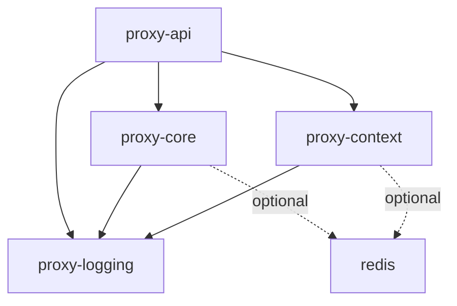

# LLM Proxy - Modular Architecture Overview

## Executive Summary

The LLM Proxy system has been redesigned from a monolithic architecture to a modular, pip-installable package structure. This transformation enables better maintainability, independent versioning, and selective deployment without using containers.

## Package Architecture

### 1. Package Structure

```
packages/
├── proxy_core/          # Core routing and resilience
├── proxy_context/       # Context management and caching
├── proxy_logging/       # Observability and logging
├── proxy_api/           # FastAPI and validation
├── pyproject.toml       # Root workspace configuration
├── .pre-commit-config.yaml
├── mypy.ini
└── migration_guide.md
```

### 2. Package Dependencies



### 3. Installation Options

#### Install All Packages
```bash
pip install -e packages/proxy_core packages/proxy_context packages/proxy_logging packages/proxy_api
```

#### Install Individual Packages
```bash
pip install -e packages/proxy_core  # Core functionality only
pip install -e packages/proxy_api[dev]  # API with dev dependencies
```

#### Install via Root Workspace
```bash
pip install -e packages[all]  # All packages
pip install -e packages[core,logging]  # Selective packages
```

## Key Features Implemented

### ✅ Modularization
- **proxy_core**: Circuit breaker, rate limiter, HTTP client, provider factory
- **proxy_context**: Context condenser, smart cache, model cache, memory manager
- **proxy_logging**: Structured logging, metrics, OpenTelemetry, Prometheus
- **proxy_api**: FastAPI endpoints, validation schemas, authentication

### ✅ Type Safety
- **mypy** with strict mode enabled
- Type hints throughout all packages
- Comprehensive type checking configuration

### ✅ Code Quality
- **pre-commit** hooks for automated quality checks
- **black** for code formatting
- **ruff** for fast linting
- **isort** for import sorting

### ✅ Observability
- **OpenTelemetry** integration ready
- **Prometheus** metrics endpoint
- **Structured JSON logging**
- Custom metrics for circuit breakers and rate limiters

### ✅ Development Experience
- Independent package versioning
- Development dependencies per package
- Comprehensive testing setup
- Migration guide provided

## Technical Specifications

### Python Version Support
- **Minimum**: Python 3.8
- **Recommended**: Python 3.11+
- **Tested**: Python 3.8, 3.9, 3.10, 3.11, 3.12

### Dependencies Management
Each package has:
- **Core dependencies**: Essential runtime requirements
- **Optional dependencies**: Extended functionality (Redis, etc.)
- **Development dependencies**: Testing and tooling

### Quality Gates
- **Type checking**: mypy strict mode
- **Code formatting**: black + isort
- **Linting**: ruff with comprehensive rules
- **Testing**: pytest with async support

## Migration Strategy

### Phase 1: Package Creation ✅
- [x] Create package structure
- [x] Define dependencies
- [x] Set up build configuration
- [x] Configure quality tools

### Phase 2: Code Migration
- [ ] Move existing code to packages
- [ ] Update import statements
- [ ] Maintain backward compatibility
- [ ] Update tests

### Phase 3: Validation
- [ ] Run comprehensive tests
- [ ] Performance benchmarking
- [ ] Integration testing
- [ ] Documentation updates

## Next Steps

The modular architecture is now ready for implementation. Each optimization from the original plan can be implemented as a separate task:

1. **Enhanced Observability** - Add custom OpenTelemetry metrics
2. **Feature Flags** - Implement Unleash/Flagsmith integration
3. **Event Bus** - Create asyncio-based event system
4. **Rust Components** - Design PyO3 extensions
5. **Plugin System** - Implement pluggy-based plugins
6. **Systemd Integration** - Update service configurations

## Usage Examples

### Basic Usage
```python
from proxy_core import CircuitBreaker, RateLimiter
from proxy_context import SmartCache
from proxy_logging import StructuredLogger

# Initialize components
breaker = CircuitBreaker("provider-name")
cache = SmartCache(max_size=1000, ttl=3600)
logger = StructuredLogger("proxy-service")
```

### Advanced Configuration
```python
from proxy_api import create_app
from proxy_logging import OpenTelemetryConfig

# Configure observability
otel_config = OpenTelemetryConfig(
    service_name="llm-proxy",
    jaeger_endpoint="http://localhost:14268/api/traces"
)

# Create FastAPI app
app = create_app(
    config_path="/etc/proxy/config.yaml",
    enable_metrics=True,
    enable_tracing=True
)
```

## Support and Documentation

- **Package Documentation**: Each package includes comprehensive README
- **API Documentation**: Auto-generated via FastAPI
- **Migration Guide**: Detailed step-by-step instructions
- **Issue Tracking**: GitHub issues per package

This modular architecture provides a solid foundation for the remaining optimizations while maintaining full backward compatibility and zero-downtime migration capability.